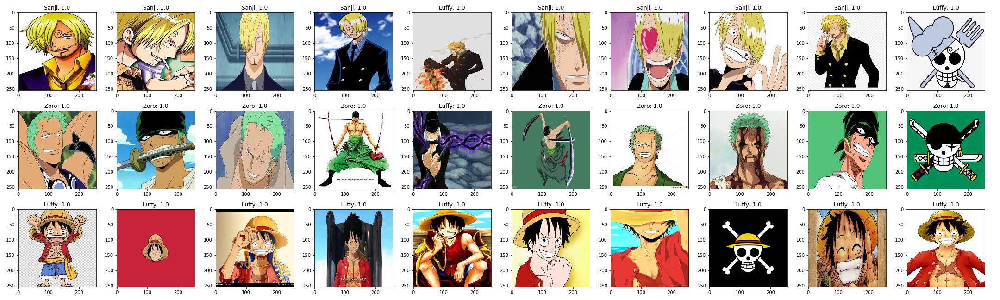

# One Piece Classifier
Using transfer learning in [Keras](https://keras.io) to classify images of characters from the show [One Piece](https://en.wikipedia.org/wiki/One_Piece).

# Transfer Learning
Acquiring the data and computational resources for deep learning can be difficult. If a dataset doesn't already exist, putting one together for a small project is often more work than the project itself. And if you don't have a GPU, training for a long time on tens of thousands of images can be prohibitive.

That's where **transfer learning** comes in. As it turns out, neural networks often specialize to their intended task in the final handful of layers. That is, if your network classifies fruits, it's really only learning the difference between an apple and an orange in the final layers. In the base layers, they are learning more fundamental things like how to extract the shape and color of the fruit from the image. **By taking these base layers and discarding the final layers, we can build on top of pre-trained networks to repurpose them for our desired task.**

In this project I used **VGG-19**, a **convolutional neural network** that was trained on over a million images from [**ImageNet**](http://image-net.org) into 1,000 categories. By removing all but the first 5 layers and then adding my own on top, I was able to leverage it to classify the images that I was interested in. And because the first few layers were already trained, I was able to get away with a dataset of only a few hundred images!

# Technologies Used

### Google Colab
I wrote this notebook in [Google Colab](https://colab.research.google.com). It came with libraries like TensorFlow, Keras, Numpy, and Matplotlib all pre-installed which was nice. And the **free GPU** access made training so much faster! It also made [TensorBoard](https://www.tensorflow.org/tensorboard) integration as simple as a couple lines of code. And it was easy to mount my Google Drive to load images into the notebook!

### Keras
Keras is a high-level neural networks API that is built on a TensorFlow backend. You sacrifice a little control, but it makes it a lot easier to start working with neural networks at a basic level. The *ImageDataGenerator* class made data wrangling and augmentation as simple as dumping images of each class into its own folder.

# Results
I trained the network to recognize 3 characters from the show One Piece: Luffy, Zoro, and Sanji. After training for 50 epochs on under 300 images, the classifier achieved accuracy of about 90%.
Looking at the sample output below, we see that it correctly identified Luffy every time, but occasionally misclassified Zoro and Sanji as Luffy. I found it particularly interesting that it correctly identified Luffy and Zoro's logos. They aren't pictures of the characters themselves, but because they exhibit characteristics of the characters the classifier was still able to identify them. It misclassified Sanji's logo as Luffy, which I suspect can be attributed to the lack of identifiable color in Sanji's logo. Where Luffy and Zoro's logos include their respective red and green colors, Sanji's logo doesn't showcase his easily identifiable yellow hair.

Overall, this is pretty solid accuracy for a limited training set. Moving forward it'd be interesting to see what I can do with problems where I have more data and am working with more than 3 classes!

# Dependencies

To run the notebook you'll have to change paths to where you have the data stored.

[Keras](https://keras.io) and [Tensorflow](https://www.tensorflow.org) - Neural network training

[Numpy](https://numpy.org) - Math

[Matplotlib](https://matplotlib.org) - Displaying images
